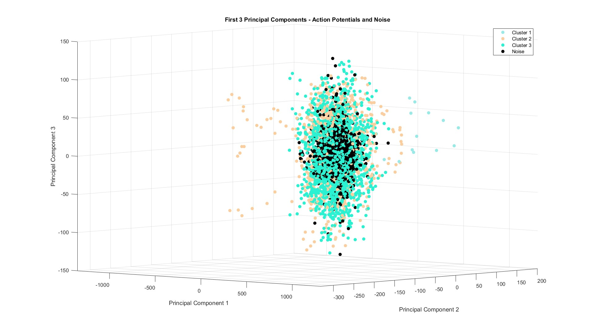
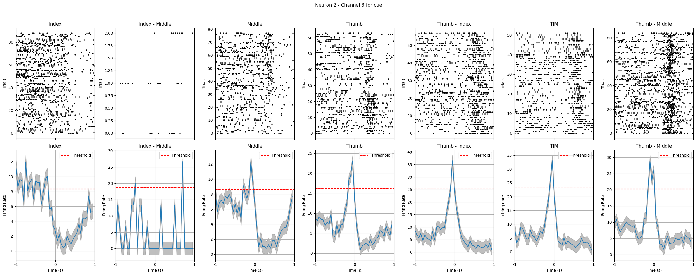
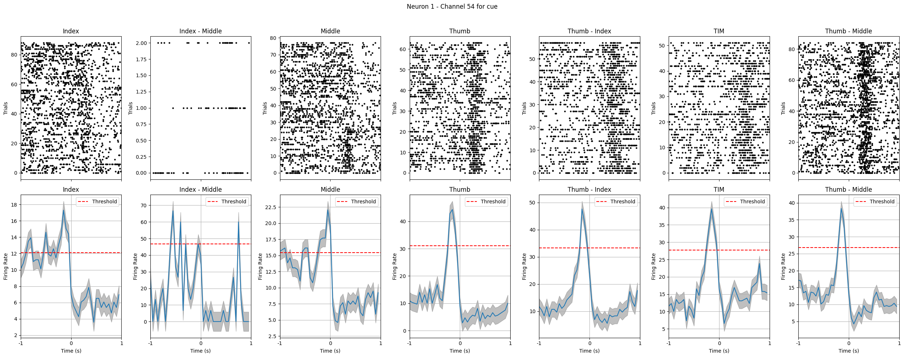
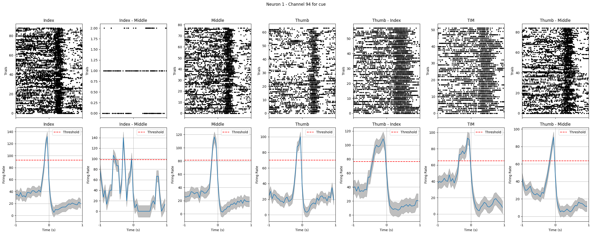
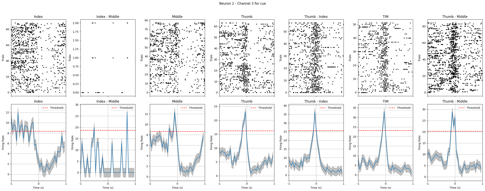
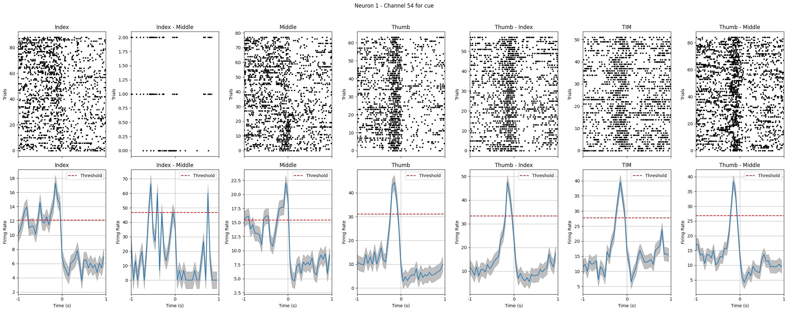
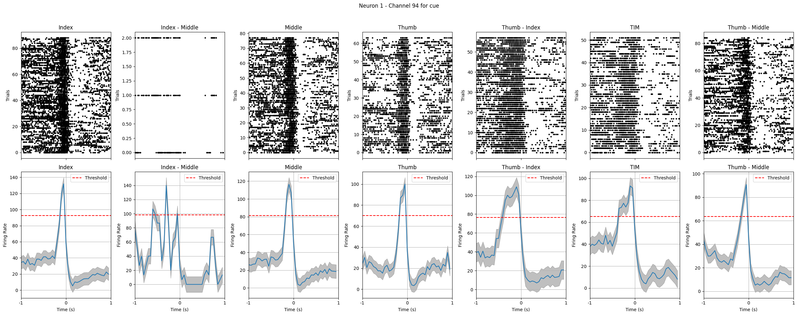
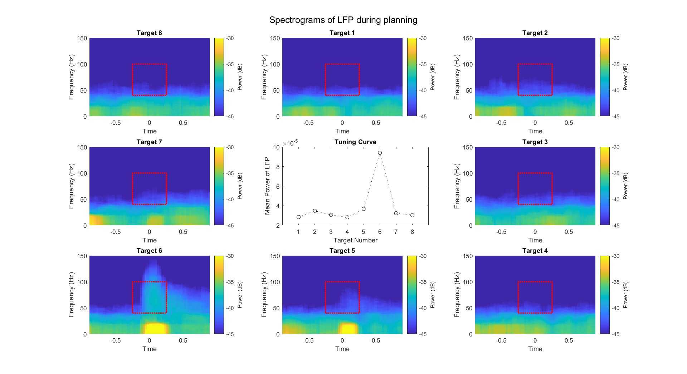
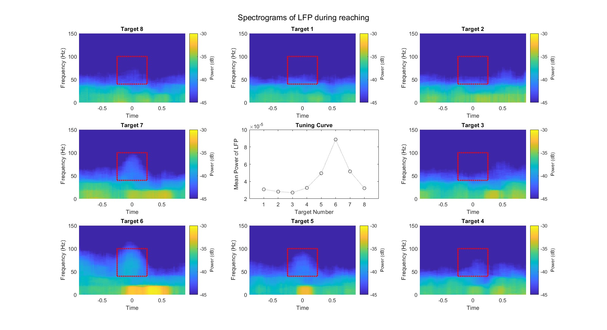

# Neural-Data-Analysis-and-Visualization BME526
This repository contains the projects I completed for the BME526 course titled "Introduction to Neural Engineering." The projects focus on analyzing and visualizing neural data using various techniques such as Principal Component Analysis (PCA), Peri-event Time Histograms (PETHs), Raster plots, spectrograms, and tuning curves.

## Projects Overview

### 1. Principal Component Analysis (PCA) on Neural Data
- **Objective:** To perform PCA on neural data from the brain and reduce the dimensionality of the data.
- **Visualization:** 
  - PCA plots showing the variance explained by the principal components.
  - Scatter plots of neural data projected onto the first few principal components.
  

### 2. Peri-event Time Histograms (PETHs) and Raster Plots of Finger Movements
- **Objective:** To draw PETHs and Raster plots of finger movements based on neural brain data.
- **Visualization:**
  - PETHs showing the firing rate of neurons in response to finger movements.
  - Raster plots visualizing the spike times of neurons around the event of finger movement.
  
![PETH's & Raster Plot]

### 3. Spectrograms and Tuning Curve Generation
- **Objective:** To generate spectrograms and a tuning curve based on the spectral power during a chosen time period and frequency band.
- **Visualization:**
  - Spectrogram plots showing the power spectrum of neural signals over time.
  - Tuning curve illustrating the relationship between the spectral power and the frequency band of interest.
  

## Repository Structure

- `.py and .mat`: Contains Python and Matlab with code for each project.
- `images/`: Contains the visualizations generated from the analysis.

## License

This repository is licensed under the MIT License. See the [LICENSE](LICENSE) file for more details.
